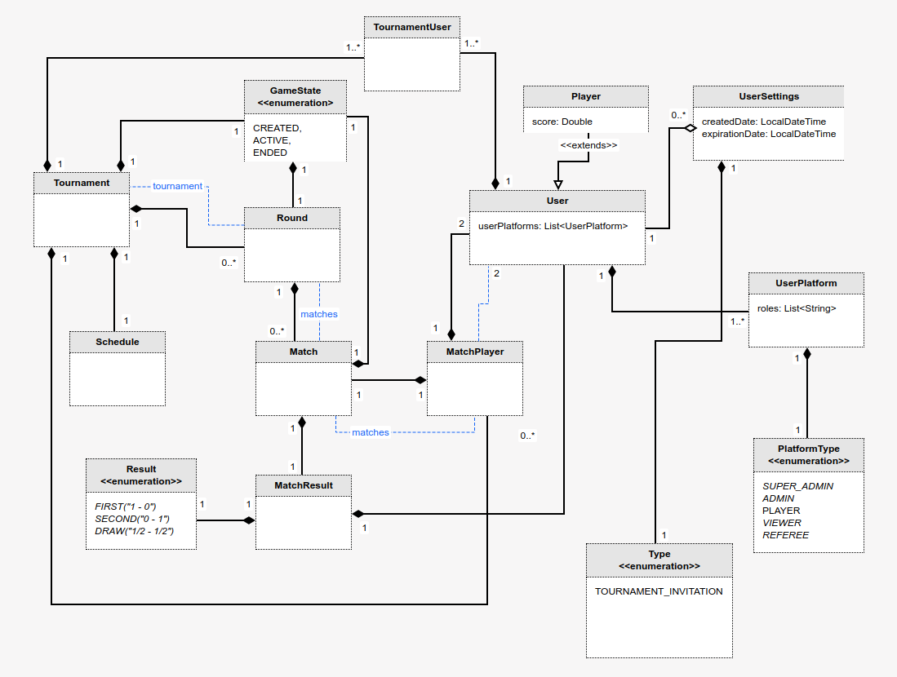
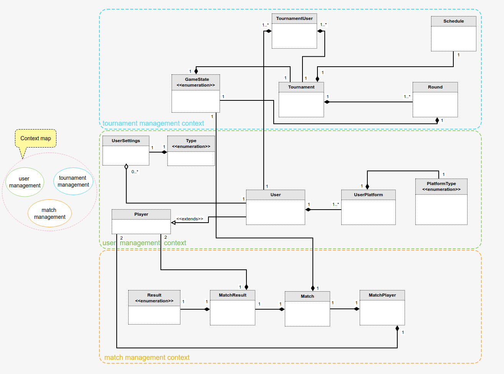
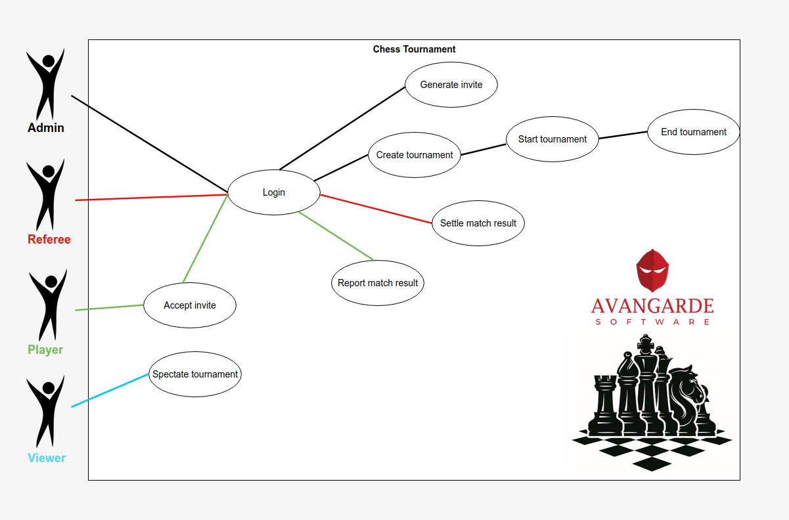
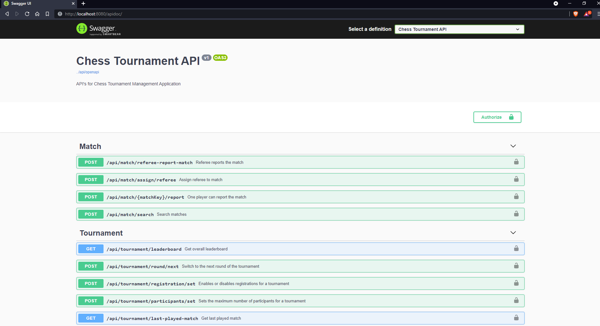

# Chess-tournament

This projects contains the back-end for the Avangarde Chess Tournament.
It's a RESTful API built with Spring and JaxRS and has an Undertow based server.
The database engine is PostgreSQL.

### ❄ Live Application

The project is live at http://46.101.179.148:8081

Prerequisites:
---------------

* [Java 8](https://openjdk.java.net/install/)
* [Maven](https://maven.apache.org/)

### ❄ Project structure
Domain Model:

Domain Driven Design:

Flow Chart:

### ❄ Endpoints

Visit http://localhost:8081/apidoc or http://46.101.179.148:8081/apidoc/ to see the endpoints.

### 🌀 Build and run
Build
---------------
* Get the latest version from the Git repository
* Run: `mvn clean install` on the root directory

Run
---------------
* Go to the `essentialprogramming-api/target` directory after building the application.
* Run: `java -jar essentialprogramming-api-1.0.0-SNAPSHOT.jar`

** Alternatively, if you open the project with an IDE, you can also run the Server.java file
located in `essentialprogramming-api/src/main/java/com/server`

### 🌀 DB Migration
To create and update the database using Flyway run the following commands in `db-migration/src/main/resources/db`

`mvn compile flyway:baseline; `

`mvn compile flyway:migrate; `